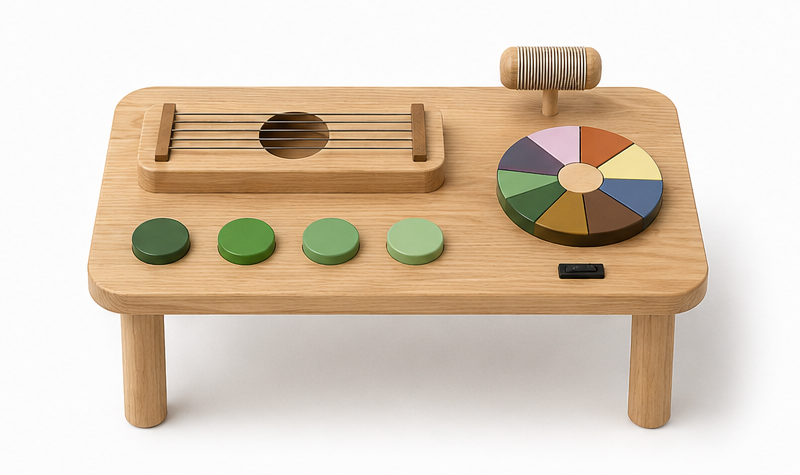

# Matilde, Filipa e Rafaela

> O nosso grupo tem o objetivo de trazer para as crianças com autismo brinquedos mais adptáveis aos seus interesses e aos estímulos que necessitam.
>  A imagem de capa acima (`attachments/hero.jpg`) deve ser uma **fotografia de conjunto** dos trabalhos do grupo, mais conceptual, que espelhe a estratégia coletiva.

## Elementos do Grupo

| Número  | Nome            |
| ------- | --------------- |
| 2024332 | Matilde Brandão |
| 2024344 | Rafaela Pereira |
| 2024321 | Filipa Gomes    |

---

## Contexto de Design

Esta coleção de brinquedos foi desenvolvida com o objetivo de promover experiências sensoriais, cognitivas e motoras adaptadas às necessidades e interesses de crianças autistas. Embora cada proposta explore diferentes formas de interação, todas partilham uma abordagem centrada na exploração livre, na descoberta e no desenvolvimento de competências através do brincar.
Apesar de apresentarem diferentes modos de utilização, os três brinquedos partilham objetivos comuns: estimular a curiosidade, promover o desenvolvimento das capacidades motoras e percetivas, incentivar a concentração e proporcionar experiências sensoriais enriquecedoras. Através da manipulação de formas, cores, texturas, sons e movimentos, as crianças são convidadas a explorar o ambiente de forma ativa e autónoma.
As brincadeiras propostas baseiam-se na exploração livre, na construção, na organização de elementos, na experimentação de relações de causa e efeito e na descoberta sensorial. Desta forma, o brincar torna-se uma ferramenta para desenvolver competências cognitivas, motoras e criativas, ao mesmo tempo que promove o envolvimento, o conforto e o prazer da interação.

[Ver contexto completo →](contexto.md)

---

## Galeria de Produtos

  <!-- duplicar o bloco abaixo para cada produto do grupo -->

  <a class="gallery-card" href="produtos/MesaSensorial/">
    
    <h3>Mesa Sensorial</h3>
    
Rafaela Pereira

  </a>

  <!-- duplicar o bloco acima para cada produto do grupo  e substituir _modelo em ambas por <numero>-<nome> -->

  <!-- duplicar o bloco abaixo para cada produto do grupo -->

  <a class="gallery-card" href="produtos/Empilha/">
    
    <h3>Empilha</h3>
    
Matilde Brandão

  </a>

  <!-- duplicar o bloco acima para cada produto do grupo  e substituir _modelo em ambas por <numero>-<nome> -->

<!-- markdownlint-enable MD033 -->

<!-- markdownlint-disable MD033 -->

  <!-- duplicar o bloco abaixo para cada produto do grupo -->

  <a class="gallery-card" href="produtos/2024321_Filipa/">
    
    <h3>Formas</h3>
    
Filipa Gomes

  </a>

  <!-- duplicar o bloco acima para cada produto do grupo  e substituir _modelo em ambas por <numero>-<nome> -->

<!-- markdownlint-enable MD033 -->
- [ ] 
