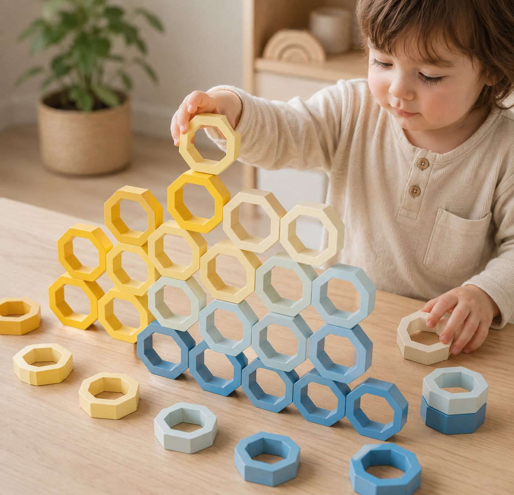

# Empilha

> Conceito: Brinquedos de madeira para crianças autistas.

## Conceito

A **Colmeia** é um brinquedo de madeira inspirado na estrutura perfeita das colmeias naturais. Através de módulos hexagonais empilháveis, convida a criança a explorar a organização, a cor, o equilíbrio e a construção de forma intuitiva e livre.
O brinquedo foi concebido para proporcionar uma experiência calma e previsível, valorizando o processo de descoberta em vez do resultado final.

 

## Enquadramento

Posicionamento em relação ao contexto de grupo (ver [contexto](../../contexto.md)) e à recolha de objetos a redesenhar.

## Tecnologia

A madeira a ser utilizada seria a Faia, perante uma pesquisa feita anteriormente, a conclusão foi que a Faia seria a melhor opção devido à sua suavidade, o facto de ser resistente ao impacto, fácil de lixar e arredondar e pela sua cor clara e neutra que permite fazer posteriormente o tingimento da própria sem problemas.
- Modelo 3D: <!-- embed Fusion ou link a360.co -->
- Ficheiros: `attachments/`

## Função

Cada peça representa uma célula de uma colmeia, a peça individualmente é simples, mas é capaz de criar infinitas combinações quando integrada num conjunto. 
A criança pode empilhar, alinhar, agrupar por cores, criar padrões ou construir estruturas tridimensionais, desenvolvendo competências cognitivas e sensoriais através da experimentação.

## Apresentação

---
Como já foi mencionado anteriormente, o objetivo do brinquedo é que a criança se sinta confortável em experimentar. 
Futuramente, o brinquedo estaria disponível em quantidades variadas, de 20 a 100 ou mais peças, para que a experiência não tenha fim.
Seguindo o nome da colmeia, a criança pode criar combinações com a altura e largura que desejar, criando assim de forma engraçada paredes onde pode brincar.

As cores do produto variam entre degradês azuis como está representado acima e estaria disponível em várias cores, como por exemplo, degradês amarelos e verdes , com possibilidades futuras de incluir também outras cores. Esta escolha seria feita na compra do produto, optando então pela cor desejada.
Estas cores iniciais ( azul, verde e amarelo) foram selecionadas a partir de uma pesquisa publicada ( https://rhemaneuroeducacao.com.br/blog/a-importancia-das-cores-para-o-autista/) onde é mencionado o azul como que proporciona e estimula o sentimento de calma e de equilíbrio, o amarelo pode ajudar com estímulo social dos mais pequenos. E o verde está ligado à madeira, à natureza.
As peças seriam feitas com a madeira Faia, passando pelo procedimento de tingir a mesma, para obter todas estas cores.

O tamanho da embalagem dependerá da quantidade de peças.
 

## Processo

O percurso completo de iterações, modelos e pesquisa está em [processo.md](processo.md), organizado do **mais recente** para o **mais antigo**.

[Ver processo completo →](processo.md)
