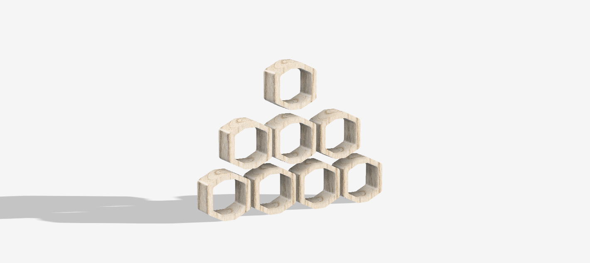
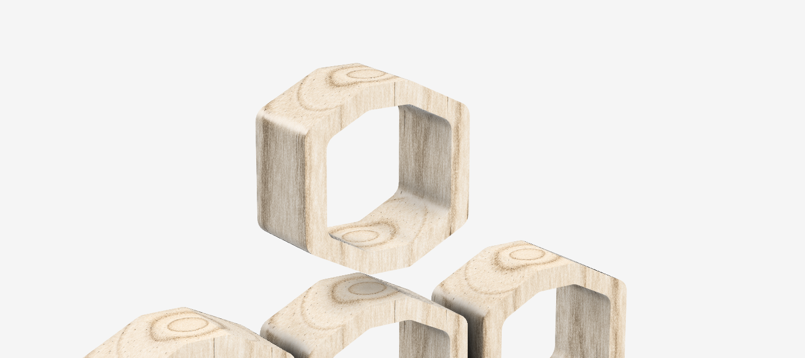
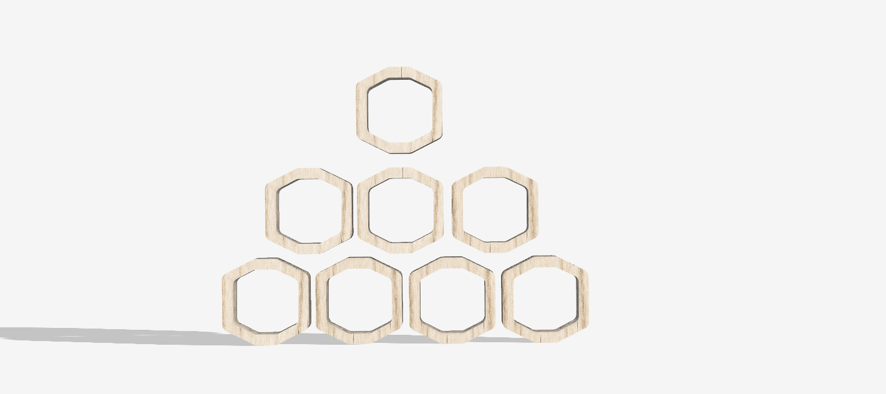

# Empilha

<!--
  HERO: idealmente uma pseudo-sessão fotográfica do produto
  (ver tutorial Pletor.ai nos Recursos da disciplina, em
  /Recursos/AI_exps/). Usa attachments/hero.jpg para o frontmatter.
-->

> Conceito: Brinquedos de madeira para crianças autistas.

## Conceito

**Colmeia** é um brinquedo de madeira inspirado na estrutura perfeita das colmeias naturais. Através de módulos hexagonais empilháveis, convida a criança a explorar a organização, a cor, o equilíbrio e a construção de forma intuitiva e livre.
O brinquedo foi concebido para proporcionar uma experiência calma e previsível, valorizando o processo de descoberta em vez do resultado final.

## Enquadramento

Posicionamento em relação ao contexto de grupo (ver [contexto](../../contexto.md)) e à recolha de objetos a redesenhar.

## Tecnologia

Falta: processos de fabrico (CNC, laser, impressão 3D), software paramétrico, ficheiros técnicos.
A madeira a ser utilizada seria a Faia, perante uma pesquisa feita anteriormente, a conclusão foi que a Faia seria a melhor opção devido à sua suavidade, o facto de ser resistente ao impacto, fácil de lixar e arredondar e pela sua cor clara e neutra que permite fazer posteriormente o tingimento da própria sem problemas.
- Modelo 3D: <!-- embed Fusion ou link a360.co -->
- Ficheiros: `attachments/`

## Função

Cada peça representa uma célula de uma colmeia, a peça individualmente é simples, mas é capaz de criar infinitas combinações quando integrada num conjunto. 
A criança pode empilhar, alinhar, agrupar por cores, criar padrões ou construir estruturas tridimensionais, desenvolvendo competências cognitivas e sensoriais através da experimentação.

## Apresentação

---

## Processo

O percurso completo de iterações, modelos e pesquisa está em [processo.md](processo.md), organizado do **mais recente** para o **mais antigo**.

[Ver processo completo →](processo.md)
