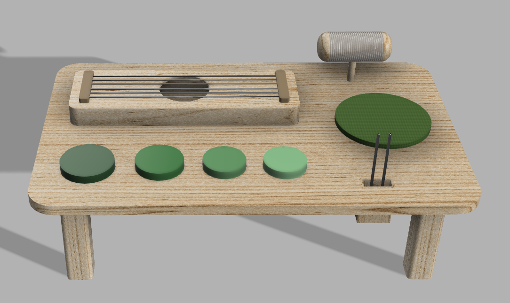
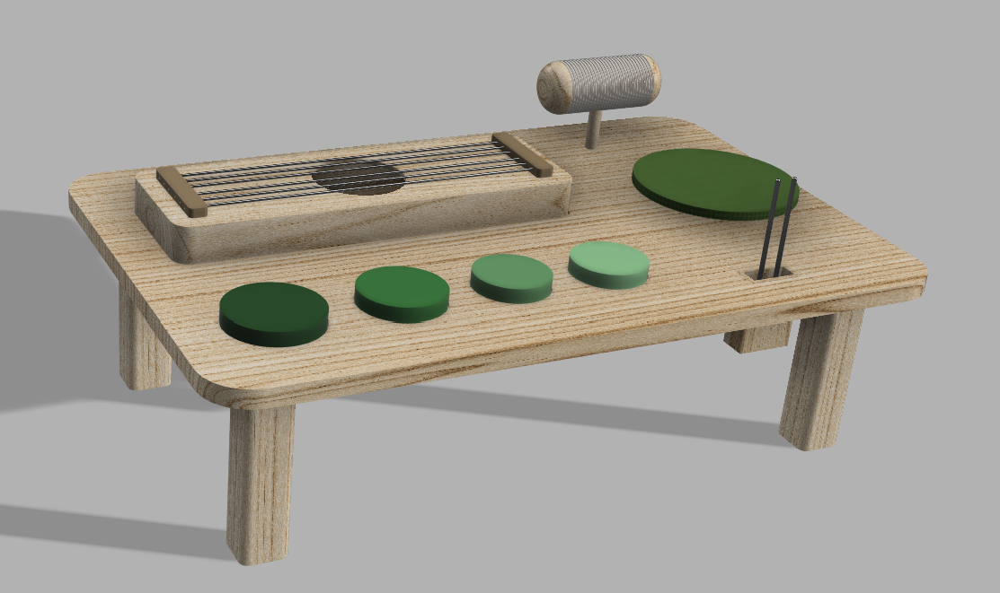
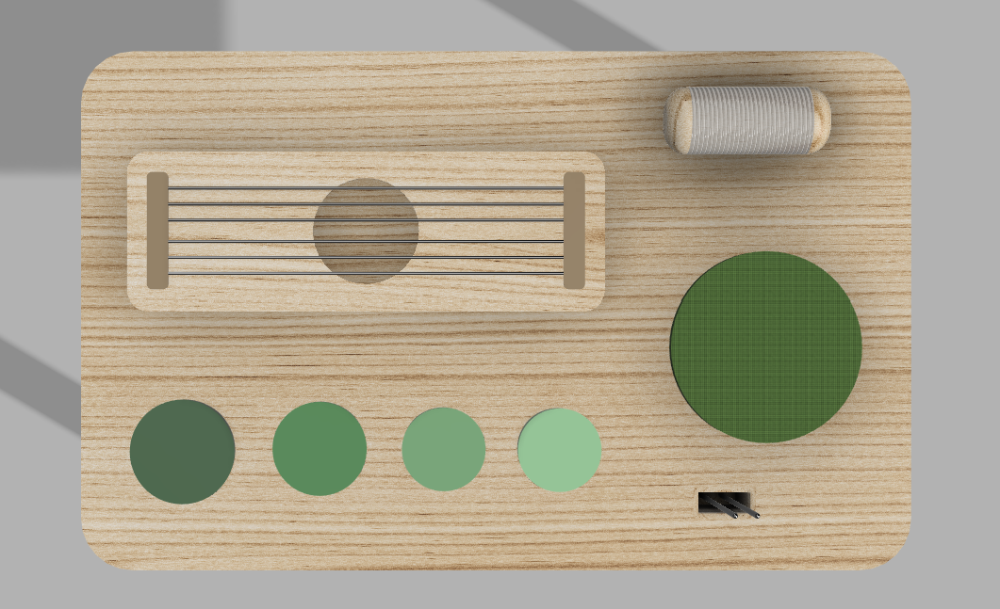

# Mesa Sensorial Auditiva

> Uma mesa interativa que estimula a exploração sensorial através do som, do toque e da cor.

## Conceito

A Mesa Sensorial Auditiva é um brinquedo educativo concebido para promover a exploração multissensorial por parte das crianças. Integra diferentes elementos interativos, incluindo cordas de guitarra, pequenos tambores e uma roda das cores, permitindo experiências de descoberta através da audição, do tato e da perceção visual.

O produto destina-se a crianças na idade pré-escolar e escolar, incentivando a criatividade, a coordenação motora e a aprendizagem através da brincadeira livre. A combinação de estímulos sonoros e visuais promove a curiosidade e o desenvolvimento cognitivo de forma intuitiva e divertida.

## Enquadramento

A Mesa Sensorial enquadra-se no tema do desenvolvimento sensorial infantil, proporcionando diferentes formas de interação num único produto. A seleção das cordas de guitarra, dos tambores e da roda das cores resulta da intenção de explorar múltiplos sentidos de forma integrada. (ver [contexto](../../contexto.md)) 

## Tecnologia

Materiais (espécie de madeira), processos de fabrico (CNC, laser, impressão 3D), software paramétrico, ficheiros técnicos.

- Modelo 3D: [https://a360.co/4wQOPxc](https://a360.co/4wQOPxc "https://a360.co/4wQOPxc")
- Ficheiros: `attachments/`

## Função

A criança pode explorar livremente os diferentes elementos da mesa:

- Tocar nas cordas para produzir sons e vibrações;
- Percutir os pequenos tambores para experimentar diferentes ritmos;
- Rodar a roda das cores para observar combinações cromáticas e explorar relações visuais.

O produto destina-se a crianças a partir dos 3 anos de idade e promove o desenvolvimento da coordenação motora fina, da perceção sensorial e da criatividade.

Na conceção do produto foram considerados princípios de segurança adequados ao público infantil, incluindo cantos arredondados, materiais resistentes e componentes devidamente fixados, de acordo com os requisitos gerais da Diretiva 2009/48/CE relativa à segurança dos brinquedos.

## Apresentação

---

## Processo

O percurso completo de iterações, modelos e pesquisa está em [processo.md](dpiv-galeria-for/produtos/MesaSensorial/processo.md), organizado do **mais recente** para o **mais antigo**.

[Ver processo completo →](dpiv-galeria-for/produtos/MesaSensorial/processo.md)
