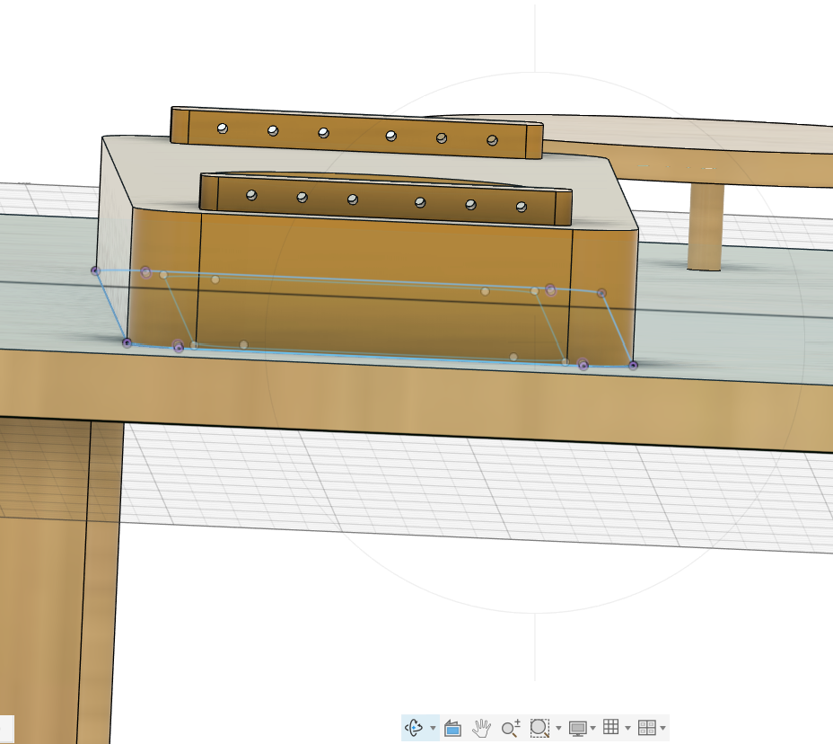
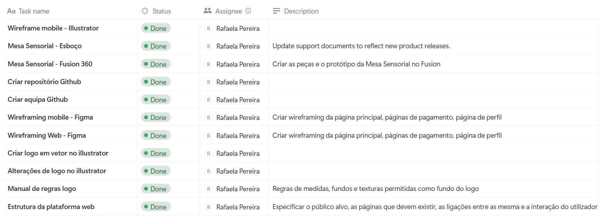

# Processo
O desenvolvimento da mesa sensorial musical teve início com uma fase de pesquisa sobre as necessidades e características de crianças com Perturbação do Espetro do Autismo (PEA). O principal objetivo do projeto foi criar um brinquedo educativo e inclusivo que promovesse a estimulação sensorial, a exploração tátil e o contacto com a música através de uma experiência simples e intuitiva.

Numa primeira fase foram analisados os elementos que mais despertam o interesse e a atenção de crianças autistas, nomeadamente estímulos visuais suaves, diferentes texturas, movimentos repetitivos e sons agradáveis. Com base nesta pesquisa surgiu a ideia de desenvolver uma mesa multissensorial que reunisse vários elementos de interação num único produto, permitindo à criança explorar diferentes sensações de forma segura e autónoma.
A música foi escolhida como elemento central do projeto devido aos seus benefícios no desenvolvimento cognitivo, emocional e social. Como inspiração principal foi utilizada a guitarra, um instrumento de fácil reconhecimento e que permite uma interação direta com o som. A inclusão de cordas na superfície da mesa procura incentivar o primeiro contacto com instrumentos musicais, despertando a curiosidade da criança e promovendo a exploração sonora através do toque.

Além da componente musical, foram integrados diversos elementos sensoriais. Os botões circulares foram concebidos para estimular a perceção tátil e visual através das suas cores e formas simples. O disco rotativo colorido permite a exploração visual e motora, incentivando movimentos repetitivos frequentemente apreciados por crianças com autismo. O cilindro texturizado acrescenta uma experiência tátil adicional, proporcionando diferentes sensações ao toque e contribuindo para a estimulação sensorial.
A construção do modelo 3D da mesa sensorial musical no Fusion 360 foi uma experiência de tentativa erro, na qual experimentei várias medidas e diferentes tipos de encaixe para as diferentes peças. 
Por exemplo, para os pad de bateria pensei em colocar parafusos, ou buchas, mas dado o tipo de material dos pads, optei por criar apenas o espaço com o tamanho de encaixe dos pads para posteriormente serem colados. Com a caixa da guitarra o procedimento foi igual. 
Com o Reco-reco foi o pensamento contrário. inicialmente pensei em colar as peças e depois optei por aparafusar a base à mesa e criar um encaixe estilo bucha do suporte para o corpo do reco-reco.

## 1. Protótipo(s)

Fotografias feitas por IA de como ficaria o produto final fotografado em estúdio.

## 2. Processo de Prototipagem

O produto final não chegou a ser fabricado, mas o processo de prototipagem que eu levaria seria o seguinte:
A estrutura principal da mesa (tampo e pernas) seria fabricada em madeira, através de maquinação CNC, de modo a obter cortes precisos e a reproduzir as dimensões estabelecidas no modelo 3D.

Os elementos interativos (cordas de guitarra, reco-reco, roda de cores, caixa para baquetas, baquetas e pads de bateria) seriam produzidos em separado e posteriormente introduzidos na mesa.
**Guitarra**: a caixa e as patilhas onde as cordas são colocadas seriam feitas em madeira, também através de maquinação CNC. As cordas seriam adicionadas posteriormente.
**Baquetas e caixa de suporte**: também fabricadas em madeira, com maquinação CNC, através do modelo 3D.
**Pads de bateria**: seriam fabricados em borracha, de modo a reproduzir o som dos pads de uma bateria elétrica.
**Reco-Reco**: construído a madeira, juntamente com o suporte que o irá prender à mesa e dar-lhe altura, através de maquinação CNC, através do modelo 3D.
**Roda de cores**: construída em madeira, juntamente com o eixo que a prende à mesa e que a faz girar, com maquinação CNC, posteriormente pintada com as cores previamente selecionadas no desenho.

Concluídas todas as partes e peças da mesa, passamos à fase de tratamento das mesmas, perceber se é preciso lixar, arredondar arestas, pintar, ou dar algum acabamento em alguma delas.
Concluído esse passo, seguimos para a montagem da mesa com todos os seus componentes, em que as pernas são aparafusadas ao tampo, a roda de cores e o reco-reco também (através do eixo e do suporte), a caixa da guitarra e os pads de bateria são afixados com super cola.
Uma vez feita a montagem completa da mesa, voltamos a fazer uma verificação do produto para perceber se existe algum acabamento que necessita ser feito.

## 3. Protótipos Exploratórios

-

## 4. Modelos 3D

Link de acesso ao modelo 3D feito no Fusion 360:
https://a360.co/4wQOPxc

## 5. Outros Modelos

Modelos físicos exploratórios, em cartão, espuma, madeira de teste,(fotos generadas por IA)

## 6. Esboços e Pranchas-Resumo

## 7. Pesquisa

### 7.1. Aspectos valorizados do moodboard, desconstrução da forma (o que distingue o programa formal)

### 7.2. Objetos de referencia

Inventário de precedentes, brinquedos análogos, referências históricas.

## 9. Outros Elementos

https://www.inspiradospeloautismo.com.br/a-abordagem/brinquedos-para-criancas-com-autismo/

